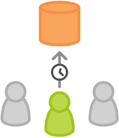

# Git Workflow
This is a tutorial about the Git Workflow on GitHub, which is also called Githubflow.

The Githubflow has only one `master` branch. You should develop on your own `feature branch` and merge it to the `master` after completing the feature.  

This is the suggested flow that Github provides.

***
## 1.  Githubflow

The core idea behind the **Githubflow** is that all feature development should take place in a dedicated branch instead of the `master branch`. This encapsulation makes it easy for multiple developers to work on a particular feature without disturbing the main codebase. It also means the master branch will never contain broken code, which is a huge advantage for continuous integration environments.


Encapsulating feature development also makes it possible to leverage `pull requests`, which are a way to initiate discussions around a branch. They give other developers the opportunity to sign off on a feature before it gets integrated into the official project. Or, if you get stuck in the middle of a feature, you can open a `pull request` asking for suggestions from your colleagues. The point is, `pull requests` make it incredibly easy for your team to comment on each other’s work.


## 2. How it works                                                                                                                                   


The Feature Branch Workflow assumes a central repository, and master represents the official project history. Instead of committing directly on their local `master` branch, developers create a new branch every time they start work on a new feature. Feature branches should have descriptive names, like animated-menu-items or issue-#1061. The idea is to give a clear, highly-focused purpose to each branch. `Git` makes no technical distinction between the `master` branch and feature branches, so developers can edit, stage, and commit changes to a feature branch.
 

In addition, feature branches can (and should) be pushed to the central repository. This makes it possible to share a feature with other developers without touching any official code. Since `master` is the only “special” branch, storing several feature branches on the central repository doesn’t pose any problems. Of course, this is also a convenient way to back up everybody’s local commits. The following is a walk-through of the life-cycle of a feature branch.


## 3.Example

The following is an example of the type of scenario in which a feature branching workflow is used. The scenario is that of a team doing `code review` around on a new feature `pull request`. This is one example of the many purposes this model can be used for.


#### Mary begins a new feature


Before she starts developing a feature, Mary needs an isolated branch to work on. She can request a new branch with the following command:

```bash
git checkout -b marys-feature master
```
This checks out a branch called marys-feature based on `master`, and the -b flag tells `Git` to create the branch if it doesn’t already exist. On this branch, Mary edits, stages, and commits changes in the usual fashion, building up her feature with as many commits as necessary:

```bash
git status
git add <some-file>
git commit
```

#### Mary goes to lunch



Mary adds a few commits to her feature over the course of the morning. Before she leaves for lunch, it’s a good idea to `push` her feature branch up to the central repository. This serves as a convenient backup, but if Mary was collaborating with other developers, this would also give them access to her initial commits.

```bash
git push -u origin marys-feature
```

This command pushes marys-feature to the central repository (`origin`), and the `-u` flag adds it as a remote tracking branch. After setting up the tracking branch, Mary can call `git push` without any parameters to push her feature.

#### Mary finishes her feature


When Mary gets back from lunch, she completes her feature. Before merging it into `master`, she needs to file a `pull request` letting the rest of the team know she's done. But first, she should make sure the central repository has her most recent commits:

```bash
git push
```
Then, she files the `pull request` in her `Git GUI` asking to merge marys-feature into `master`, and team members will be notified automatically. The great thing about pull requests is that they show comments right next to their related commits, so it's easy to ask questions about specific changesets.

#### Bill receives the pull request


Bill gets the `pull request` and takes a look at marys-feature. He decides he wants to make a few changes before integrating it into the official project, and he and Mary have some back-and-forth via the `pull request`.

#### Mary makes the changes


To make the changes, Mary uses the exact same process as she did to create the first iteration of her feature. She edits, stages, commits, and pushes updates to the central repository. All her activity shows up in the `pull request`, and Bill can still make comments along the way.

If he wanted, Bill could pull marys-feature into his local repository and work on it on his own. Any commits he added would also show up in the `pull request`.

#### Mary publishes her feature


Once Bill is ready to accept the `pull request`, someone needs to merge the feature into the stable project (this can be done by either Bill or Mary):

```bash
git checkout master
git pull
git pull origin marys-feature
git push
```

This process often results in a merge commit. Some developers like this because it’s like a symbolic joining of the feature with the rest of the code base. But, if you’re partial to a linear history, it’s possible to rebase the feature onto the tip of `master` before executing the merge, resulting in a fast-forward merge.

Some GUI’s will automate the `pull request` acceptance process by running all of these commands just by clicking an “Accept” button. If yours doesn’t, it should at least be able to automatically close the `pull request` when the feature branch gets merged into master.


While Mary and Bill are working on marys-feature and discussing it in her `pull request`, John is doing the exact same thing with his own feature branch. By isolating features into separate branches, everybody can work independently, yet it’s still trivial to share changes with other developers when necessary.

### Meanwhile, John is doing the exact same thing


While Mary and Bill are working on marys-feature and discussing it in her `pull request`, John is doing the exact same thing with his own feature branch. By isolating features into separate branches, everybody can work independently, yet it’s still trivial to share changes with other developers when necessary.

## 4.Summary

 This workflow helps organize and track branches that are focused on business domain feature sets. Some key associations to make with the Feature Branch Workflow are:

- focused on branching patterns
- can be leveraged by other repo oriented workflows
- promotes collaboration with team members through pull requests and merge reviews

Githubflow is very suitable for constantly released products. However, in some cases like developing APP on Applestore, your products need to be reviewed before it publish to user. At the meanwhile, your `master` brach may have some new features, that make your `master` incoistant with your released version. In this case, you need keep another branch to track your last released version.  
  
    

***
#### Refrence
[Git Feature Branch Workflow](https://www.atlassian.com/git/tutorials/comparing-workflows/feature-branch-workflow)

[Git 工作流程](http://www.ruanyifeng.com/blog/2015/12/git-workflow.html)  

[Markdown 语法说明](http://www.appinn.com/markdown/#p)
